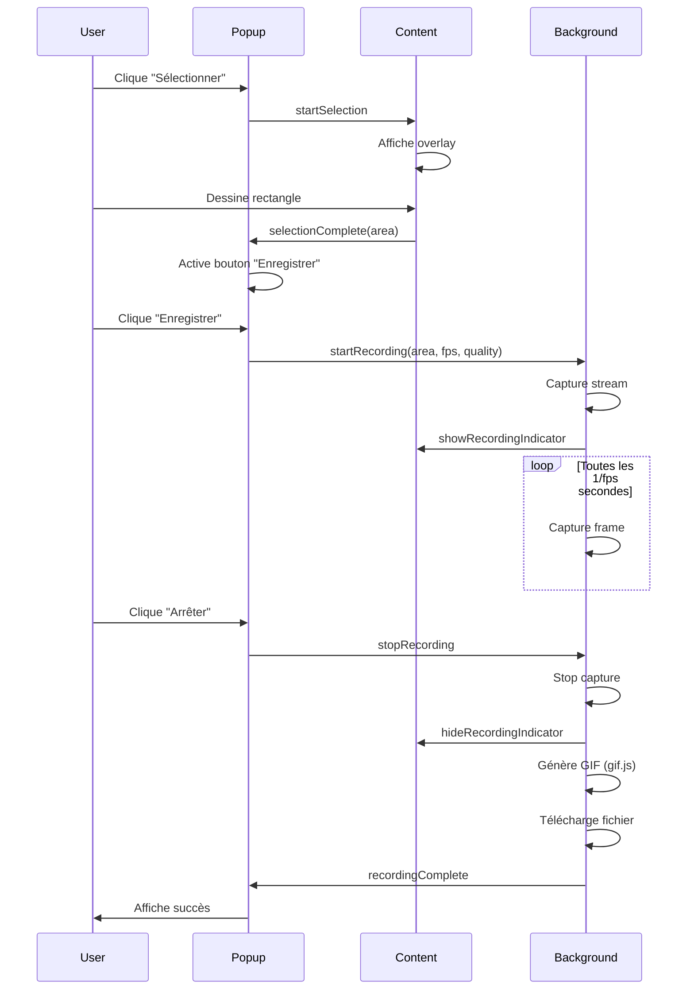

# 🏗️ QuickGif - Architecture Technique

Documentation détaillée de l'architecture de l'extension QuickGif.

---

## 📐 Vue d'ensemble

QuickGif est une extension Chrome Manifest V3 qui capture une zone sélectionnée de l'écran et la convertit en GIF animé.

### Stack Technique

- **Manifest Version** : V3 (dernière norme Chrome)
- **Langage** : JavaScript vanilla (pas de framework)
- **Librairie GIF** : gif.js (encodage côté client)
- **API principale** : chrome.tabCapture (capture d'onglet)
- **Architecture** : Event-driven avec message passing

---

## 🧩 Composants Principaux

### 1. Popup (Interface Utilisateur)

**Fichiers** : `popup.html`, `popup.css`, `popup.js`

**Responsabilités** :
- Afficher l'interface de contrôle
- Gérer les paramètres (FPS, qualité)
- Coordonner les actions (sélection, enregistrement, arrêt)
- Afficher le statut et la progression

**Communication** :
```javascript
// Vers content script
chrome.tabs.sendMessage(tabId, { action: 'startSelection' });

// Vers background
chrome.runtime.sendMessage({ action: 'startRecording', ... });

// Écoute des messages
chrome.runtime.onMessage.addListener((message, sender, sendResponse) => {
  // Gère les réponses
});
```

**États** :
- `idle` : Prêt à capturer
- `selecting` : Sélection en cours
- `ready` : Zone sélectionnée
- `recording` : Enregistrement en cours
- `processing` : Génération du GIF

### 2. Content Script (Sélection de Zone)

**Fichiers** : `content.js`, `content.css`

**Responsabilités** :
- Créer l'overlay de sélection
- Gérer les événements souris (mousedown, mousemove, mouseup)
- Calculer les coordonnées de la zone
- Afficher l'indicateur d'enregistrement

**Injection** :
```javascript
// Injecté via manifest.json
"content_scripts": [{
  "matches": ["<all_urls>"],
  "js": ["content.js"],
  "css": ["content.css"]
}]

// Ou dynamiquement via popup
chrome.scripting.executeScript({
  target: { tabId },
  files: ['content.js']
});
```

**Overlay** :
- Fond sombre avec backdrop-filter
- Rectangle de sélection avec bordure
- Label de dimensions en temps réel
- Texte d'aide centré

**Messages** :
```javascript
// Reçoit
startSelection    // Démarre la sélection
getSelection      // Retourne la zone sélectionnée
clearSelection    // Efface la sélection

// Envoie
selectionComplete // Zone sélectionnée avec succès
```

### 3. Background Service Worker (Capture & Encodage)

**Fichier** : `background.js`

**Responsabilités** :
- Capturer le stream vidéo de l'onglet
- Extraire les frames de la zone sélectionnée
- Encoder le GIF avec gif.js
- Télécharger le fichier final

**État global** :
```javascript
recordingState = {
  isRecording: false,
  mediaStream: null,
  videoElement: null,
  canvas: null,
  ctx: null,
  frames: [],
  area: { left, top, width, height },
  fps: 15,
  quality: 10
}
```

**Flux de travail** :
1. Reçoit `startRecording` avec paramètres
2. Capture le stream via `chrome.tabCapture.capture()`
3. Crée un `<video>` et un `OffscreenCanvas`
4. Capture des frames à intervalles réguliers (basé sur FPS)
5. Stocke les ImageData dans `frames[]`
6. À l'arrêt, génère le GIF avec gif.js
7. Télécharge via `chrome.downloads.download()`

---

## 🔄 Flux de Données

### Scénario complet : Capture d'un GIF



---

## 🎨 Système de Design

### Palette de Couleurs

```css
--primary: #6366f1       /* Indigo - Actions principales */
--primary-dark: #4f46e5  /* Indigo foncé - Hover */
--primary-light: #818cf8 /* Indigo clair - Highlights */
--success: #10b981       /* Vert - Succès */
--danger: #ef4444        /* Rouge - Enregistrement/Erreur */
--text-primary: #1e293b  /* Texte principal */
--text-secondary: #64748b /* Texte secondaire */
--bg-primary: #ffffff    /* Fond principal */
--bg-secondary: #f8fafc  /* Fond secondaire */
--border: #e2e8f0        /* Bordures */
```

### Animations

**Popup** :
- Fade-in séquentiel des éléments (stagger)
- Pulse sur l'icône de statut
- Shimmer sur la barre de progression
- Bounce sur succès

**Content** :
- SlideIn/SlideOut pour notifications
- RecordPulse pour indicateur d'enregistrement
- Transition smooth pour le rectangle de sélection

### Typographie

```css
font-family: -apple-system, BlinkMacSystemFont, 'Segoe UI', 'Roboto', 'Oxygen', 'Ubuntu', sans-serif;
```

Système de police natif pour chaque OS.

---

## 🔐 Permissions

### Requises

```json
{
  "permissions": [
    "activeTab",      // Accès à l'onglet actif
    "scripting",      // Injection de scripts
    "storage",        // Sauvegarde des paramètres
    "downloads"       // Téléchargement du GIF
  ],
  "host_permissions": [
    "<all_urls>"      // Capture sur tous les sites
  ]
}
```

### Justification

- `activeTab` : Nécessaire pour identifier l'onglet à capturer
- `scripting` : Injection du content script pour la sélection
- `storage` : Sauvegarde des préférences utilisateur (FPS, qualité)
- `downloads` : Téléchargement automatique du GIF généré
- `<all_urls>` : Permet la capture sur n'importe quel site web

---

## ⚙️ Configuration

### Paramètres utilisateur

Stockés via `chrome.storage.local` :

```javascript
{
  fps: 10 | 15 | 20 | 30,      // Images par seconde
  quality: 5 | 10 | 15          // Qualité d'encodage
}
```

### Valeurs par défaut

```javascript
DEFAULT_FPS = 15
DEFAULT_QUALITY = 10  // Moyenne
```

### Limites techniques

```javascript
MIN_SELECTION_SIZE = 50×50 px
MAX_FPS = 30
MIN_FPS = 10
COUNTDOWN_DURATION = 3s
```

---

## 📦 Encodage GIF

### Librairie : gif.js

**Configuration** :
```javascript
const gif = new GIF({
  workers: 4,              // 4 Web Workers pour performance
  quality: 10,             // 1-30 (1 = meilleur, 30 = plus rapide)
  width: area.width,
  height: area.height,
  workerScript: 'lib/gif.worker.js'
});
```

**Processus** :
1. Ajout de frames : `gif.addFrame(imageData, { delay })`
2. Rendu : `gif.render()`
3. Événements :
   - `progress` : Progression 0-1
   - `finished` : Blob du GIF final

**Optimisations** :
- Encoding asynchrone via Web Workers
- Pas de blocage de l'UI principale
- Progression en temps réel

---

## 🚀 Performance

### Optimisations implémentées

1. **OffscreenCanvas** :
   - Rendu hors thread principal
   - Moins de reflow/repaint

2. **Web Workers** :
   - 4 workers parallèles pour l'encodage
   - Pas de freeze de l'UI

3. **ImageData directe** :
   - Pas de conversion Blob intermédiaire
   - Manipulation directe des pixels

4. **Throttling des frames** :
   - Capture basée sur FPS configuré
   - Évite la surcapture

### Métriques

| Configuration | Taille GIF | Temps génération | RAM |
|---------------|------------|------------------|-----|
| 640×480, 10fps, 5s | ~800 KB | ~5s | ~150 MB |
| 800×600, 15fps, 10s | ~2 MB | ~12s | ~300 MB |
| 1024×768, 30fps, 10s | ~5 MB | ~30s | ~600 MB |

---

## 🐛 Gestion d'Erreurs

### Stratégies

1. **Try-Catch** autour des opérations critiques
2. **Vérifications de nullité** avant accès aux propriétés
3. **Notifications utilisateur** en cas d'erreur
4. **Logs console** détaillés pour debug

### Erreurs gérées

```javascript
// Capture échouée
if (!mediaStream) {
  chrome.notifications.create({
    type: 'basic',
    title: 'Erreur',
    message: 'Impossible de capturer l\'onglet'
  });
}

// Zone trop petite
if (width < 50 || height < 50) {
  showNotification('Zone trop petite (min 50×50)', 'warning');
  return;
}

// Génération GIF échouée
gif.on('error', (error) => {
  console.error('GIF encoding error:', error);
  alert('Erreur lors de la génération du GIF');
});
```

---

## 🔮 Évolutions Futures

### Fonctionnalités prévues

1. **Mockup de dispositifs** (iPhone, MacBook)
   - Incrustation dans des frames de téléphones
   - Fond personnalisable

2. **Édition post-capture**
   - Trim (découper)
   - Crop (recadrer)
   - Vitesse (ralenti/accéléré)

3. **Export multi-format**
   - MP4 (via MediaRecorder)
   - WebM
   - Séquence PNG

4. **Optimisations**
   - Compression adaptive
   - Palette de couleurs optimisée
   - Dithering intelligent

5. **Fonctionnalités avancées**
   - Capture avec audio
   - Annotations en temps réel
   - Curseur de souris visible
   - Raccourcis clavier personnalisables

---

## 📚 Références

### APIs utilisées

- [chrome.tabCapture](https://developer.chrome.com/docs/extensions/reference/tabCapture/)
- [chrome.runtime.sendMessage](https://developer.chrome.com/docs/extensions/reference/runtime/#method-sendMessage)
- [chrome.scripting](https://developer.chrome.com/docs/extensions/reference/scripting/)
- [chrome.downloads](https://developer.chrome.com/docs/extensions/reference/downloads/)
- [OffscreenCanvas](https://developer.mozilla.org/en-US/docs/Web/API/OffscreenCanvas)

### Librairies

- [gif.js](https://github.com/jnordberg/gif.js) - Encodage GIF côté client

### Standards

- [Manifest V3](https://developer.chrome.com/docs/extensions/mv3/intro/)
- [Content Scripts](https://developer.chrome.com/docs/extensions/mv3/content_scripts/)
- [Service Workers](https://developer.chrome.com/docs/extensions/mv3/service_workers/)

---

**Architecture solide, performante et extensible pour une expérience utilisateur fluide ! 🚀**
